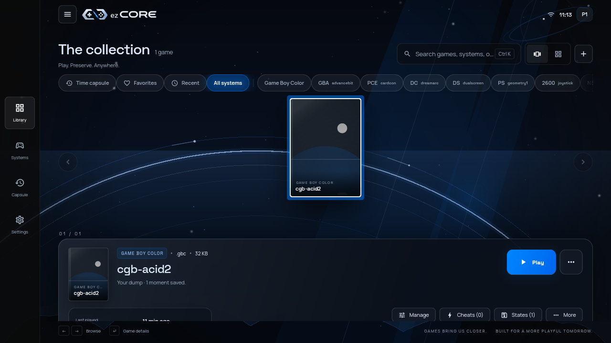
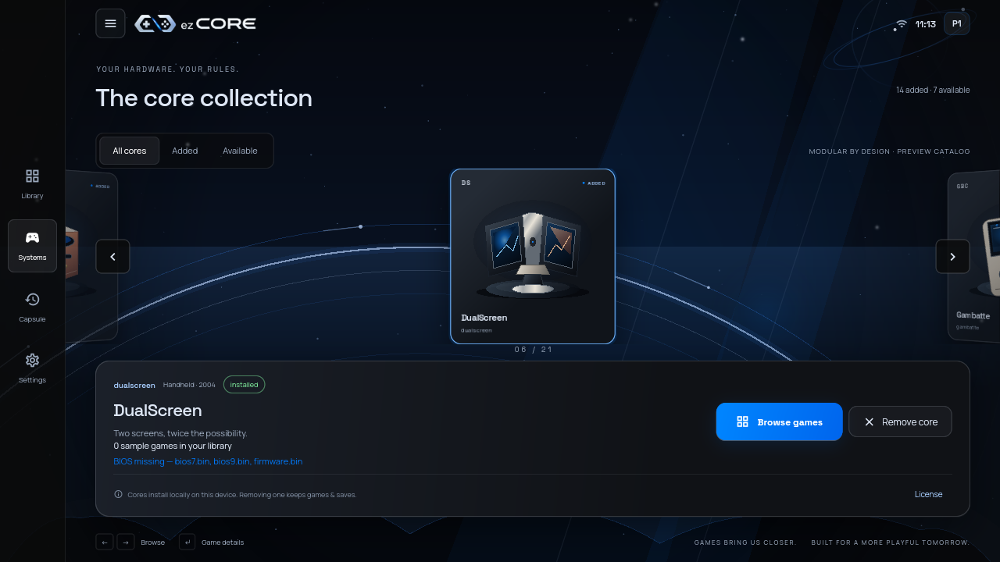
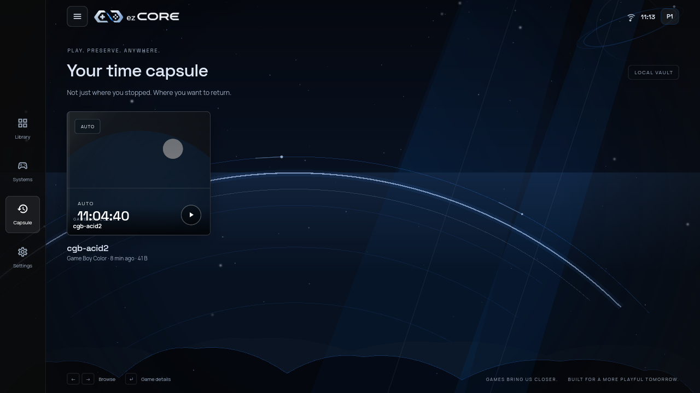
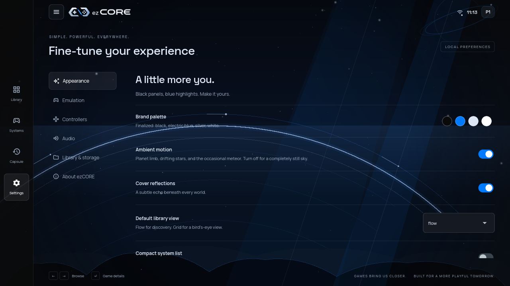

<p align="center">
  <picture>
    <source media="(prefers-color-scheme: dark)" srcset="assets/branding/lockup-light.png">
    <source media="(prefers-color-scheme: light)" srcset="assets/branding/lockup-dark.png">
    
  </picture>
</p>

<p align="center">
  <strong>One shell. Many generations. More play.</strong><br>
  <em>ezCORE is building the easy-to-use emulator experience we wanted to use.</em>
</p>

<p align="center">
  <a href="https://github.com/JinUltimate1995/ezcore/releases">
    
  </a>
  <a href="LICENSE">
    
  </a>
  
  <a href="docs/MATRIX.md">
    
  </a>
  <a href="https://github.com/sponsors/JinUltimate1995">
    
  </a>
</p>

<p align="center">
  <a href="#the-mission">The mission</a> ·
  <a href="#latest-progress">Progress</a> ·
  <a href="#the-road-ahead">Road ahead</a> ·
  <a href="#the-experience">Experience</a> ·
  <a href="#download">Download</a> ·
  <a href="#build-from-source">Build</a> ·
  <a href="#contributing">Contribute</a> ·
  <a href="#support-ezcore">Support</a>
</p>

<p align="center">
  <strong>Help shape the console:</strong>
  <a href="#contributing">contribute</a> ·
  <a href="#support-ezcore">support development</a>
</p>

---

## The mission

### The emulator should feel like a console.

Not a folder of tools. Not a wall of settings. A **single, beautiful home for
the games you already love** — with the complexity held underneath and the game
kept in front.

That is the ezCORE north star:

> **One library. A growing universe of cores. A simple, polished experience.**

We are building the path from **open your game → press Play → return to your
save** without breaking the experience apart every time a new system, core, or
platform enters the picture.

### Why ezCORE

| Advantage | What it means |
|---|---|
| **A real product surface** | Orbit is designed like a console: responsive, focused, and ready for a living-room display, desktop, handheld, or phone. |
| **Easy to use** | A polished UI/UX keeps the game in front and the complexity out of the way. |
| **One place for your collection** | Your library, systems, saves, screenshots, and preferences live in one coherent experience. |
| **Power without the ceremony** | ezCORE resolves the compatible core path and keeps advanced controls available when you want them. |
| **Local by default** | ezCORE does not require an account, telemetry, or analytics. Your content and saves stay yours. |
| **Built to grow** | New cores, themes, controller layouts, graphics, mods, and platform shells can join the same foundation. |

The interface is the product. Orbit is the first expression of that idea.

---

## Latest progress

### Progress log — 2026-09-24

**Current checkpoint: ezCORE `v0.2.0` — public experimental build.**

The project is moving from “emulator infrastructure” toward a complete console
experience. Recent milestones include:

- **Hybrid core delivery** — large desktop cores can be fetched explicitly and
  are SHA-256 verified before they are staged.
- **A real game library** — validated imports, watched folders, search, filters,
  favorites, recent games, and deterministic cover art.
- **A connected player** — frames, audio, input, pause, fast-forward, reset,
  screenshots, cheats, BIOS guidance, and local saves share one runtime path.
- **Orbit responsive UI** — four layout families, animated space-scene motion,
  reduced-motion support, and shared library state across the shell.
- **A durable project direction** — the roadmap, core matrix, architecture
  state, and verification records now travel with the code.

### The foundation by the numbers

| Signal | Current |
|---|---:|
| Active core manifests | **18** |
| Reserved policy slots | **3** |
| Target platform shells | **5** |
| Responsive layout families | **4** |
| Shared runtime ABI | **1** |
| Native CTest baseline on the current Linux checkout | **3 / 3** |

The numbers are a snapshot, not a finish line. They show the shape of the
platform taking form: one shared surface, many systems, and a growing set of
tools around the game.

For exact platform and core evidence, see [`docs/MATRIX.md`](docs/MATRIX.md).
For the complete direction, see [`ROADMAP.md`](ROADMAP.md).

---

## The experience

### Library

A home for the whole collection — not a raw directory listing. Browse by
system, search across games, keep favorites close, and return to what you were
playing.

### Systems

A transparent core catalog with system matching, extension support, license and
provenance information, delivery policy, and pinned artifacts.

### Time Capsule

Local save states with named slots, timestamps, autosave, and per-game battery
save directories. Your return point stays attached to the game.

### Player

A focused play surface for frames, sound, input, pause, fast-forward, reset,
screenshots, live cheat entries, and save/load actions.

### Settings

Local preferences for the way you play: audio, input, storage, appearance, and
emulation behavior.

The imagery below is captured from the real Linux debug build of the current
Flutter shell. Library uses the temporary SameBoy `cgb-acid2` test ROM, Systems
uses the live core catalog with original, unbranded material artwork, Capsule
uses a temporary local save slot, and Settings is the live preferences screen.
Capture data stays outside the repository; no commercial ROMs or proprietary
game artwork are included.

---

## Screens

| Library | Systems |
|:---:|:---:|
|  |  |
| **Your collection, with a point of view.** | **Every core has a story and a place.** |

| Time Capsule | Settings |
|:---:|:---:|
|  |  |
| **Return to the moment you saved.** | **Tune the experience without leaving the device.** |

*Real Linux debug captures using public-domain or local test data only.*

---

## The road ahead

The roadmap is a sequence of releases, not a wall of restrictions. Each phase
adds another layer to the same experience.

| Track | In the build now | Next destination |
|---|---|---|
| **A beautiful shell** | Orbit navigation, Library, Systems, Time Capsule, Player, Settings, responsive layouts | Richer motion, theme packages, controller skins, TV and handheld shells |
| **One home for more systems** | 18 active core manifests, modular delivery, pinned artifacts, hybrid downloads | More compatible cores, renderer profiles, broader platform coverage |
| **Play without searching elsewhere** | Local cheat entry management, validation, import/export, and live toggles | A first-class Cheat Center with per-game codes, presets, search, and one-tap use |
| **Make it yours** | Orbit tokens and local appearance settings | Complete themes, button layouts, shell customization, graphics packages, and mods |
| **Take your saves with you** | Local Time Capsule, opaque state bytes, per-game SRAM handoff | Backups, version history, portable packages, and optional sync |
| **Play everywhere** | macOS, Linux, Windows, Android, and iOS platform seams | Steam Deck, handhelds, TV/controller-first layouts, and more verified devices |
| **Keep the foundation strong** | C11 ABI, runtime tests, manifest validation, license/provenance gates | Capability discovery, configuration hierarchy, diagnostics, and stronger compatibility evidence |

### The north star

**One emulator to play it all.**

Not by pretending every core behaves identically. By giving every core a
consistent home, a clear capability model, and a UI that makes the differences
feel like features instead of friction.

The full, status-tracked plan lives in [`ROADMAP.md`](ROADMAP.md). Planned
items are marked as roadmap work; shipped behavior is tracked in
[`docs/MATRIX.md`](docs/MATRIX.md).

---

## What is working now

The current foundation already connects the important pieces:

- **Game → Play** — the library resolves a compatible installed core and hands
  content to the verified player path.
- **Bring your own content** — file and folder import, ROM plausibility checks,
  SHA-256 deduplication, watched folders, search, and filters.
- **A real player loop** — video frames, PCM audio, keyboard/gamepad/touch
  input, pause, fast-forward, reset, screenshots, and lifecycle handling.
- **Local saves** — Time Capsule slots, autosave, opaque runtime state, and
  per-game SRAM directories.
- **A modular core system** — manifests, licenses, provenance, delivery policy,
  SHA-256 pins, and platform-aware execution data.
- **A cross-platform shell** — Flutter UI with macOS, Linux, Windows, Android,
  and iOS platform seams.

This is the foundation the next chapters grow from.

---

## Download

ezCORE is distributed through GitHub Releases. You bring the game content and
any system files you are permitted to use; the project does not ship ROMs,
BIOS images, firmware, or keys.

| Platform | Path | Current checkpoint |
|---|---|---|
| **macOS arm64** | [Latest release](https://github.com/JinUltimate1995/ezcore/releases/latest) `.zip` | Run evidence; early public build |
| **Android arm64-v8a** | [Latest release](https://github.com/JinUltimate1995/ezcore/releases/latest) `.apk` | Built and staged; device verification continues |
| **Windows x64** | [Build from source](docs/BUILDING.md) | Cross-platform build path |
| **Linux x64** | [Build from source](docs/BUILDING.md) | Cross-platform build path |
| **iOS arm64** | [Build/integration guide](docs/BUILDING.md) | Interpreter policy and framework path |

There is currently no Mac App Store or Play Store submission. The official
distribution path is GitHub Releases.

For installation, BIOS placement, and first-launch instructions, read
[`docs/INSTALL.md`](docs/INSTALL.md).

<details>
<summary><strong>macOS first launch</strong></summary>

Releases are ad-hoc signed and may not be notarized. If macOS blocks the app:

```bash
xattr -cr /Applications/ezCore.app
```

You can also right-click the app and choose **Open**.
</details>

---

## Core catalog

The core catalog is designed to grow with the platform. Each core is a
versioned, credited, policy-aware plugin rather than a hidden dependency.

| Family | Systems and ezCORE cores | Notes |
|---|---|---|
| Handheld | **Game Boy / Game Boy Color** — `PocketBit`, `Gambatte` · **Game Boy Advance** — `AdvanceBit` | PocketBit is the shipped GB/GBC path; Gambatte remains catalog/policy-only because of its upstream license |
| 8/16-bit classics | **NES / Famicom** — `NesByte` · **Atari 2600** — `Joystick` · **PC Engine / TurboGrafx-16** — `CardCon` · **Super Nintendo** — `SuperFX` · **Genesis / Master System / Game Gear** — `BlastProc` | SNES/Genesis recipes are retained for non-commercial upstreams but are not distributed |
| Disc and 3D consoles | **PlayStation** — `Geometry1` · **Nintendo 64** — `RCP64` · **Nintendo DS** — `DualScreen` · **PSP** — `PortComp` · **Dreamcast / NAOMI** — `DreamArc` · **GameCube / Wii** — `PowerCube` · **Saturn** — `TwinSH` | Several paths require renderer/core-option work before gameplay can be claimed |
| PC and adventure | **DOS** — `RealMode` · **SCUMM / adventure** — `PointClick` | DOS and adventure catalog paths |
| Arcade | **Arcade / Neo Geo** — `CoinBox` | Build recipe only because of upstream distribution terms |
| Reserved policy slots | **Nintendo 3DS** — `citra_hold` · **Nintendo Switch** — `switch_hold` · **PlayStation 2** — `ps2_hold` | Never built or shipped under the current project policy |

Console names are used descriptively to identify compatibility targets; the
names, marks, and logos remain with their respective owners. Cores retain
their upstream licenses and attribution. See
[`docs/CORE_NAMING.md`](docs/CORE_NAMING.md), each
`cores/<id>/manifest.json`, and [`THIRD_PARTY_NOTICES.md`](THIRD_PARTY_NOTICES.md).

The matrix distinguishes **BUILT**, **IDENTIFIES**, **RENDERS**, and
**SHIPPED** so progress is visible without turning the catalog into a wall of
claims.

---

## Architecture

The product can grow without turning the UI into a collection of core-specific
special cases.

```text
Flutter / Orbit UI
        ↓
Dart application services + local state
        ↓
Emulation worker isolate
        ↓ dart:ffi
C11 ezCORE runtime · ABI v1
        ↓ libretro C API
Pinned, modular core artifacts
```

The architecture gives the project room to add systems and platforms while
keeping the experience coherent:

- Cores never talk directly to Flutter.
- The runtime owns execution, video/audio, input, cheats, and opaque state.
- Manifests carry provenance, licensing, delivery, execution, BIOS, and pins.
- A shared capability contract is the next foundation milestone.
- Local-first operation remains the default across the product.

Read [`docs/ARCHITECTURE.md`](docs/ARCHITECTURE.md),
[`docs/CORE_SYSTEM.md`](docs/CORE_SYSTEM.md), and
[`docs/DECISIONS.md`](docs/DECISIONS.md) for the technical direction.

---

## Build from source

Build the runtime, a core tier, the catalog, and the Flutter shell from one
checkout.

```bash
git clone https://github.com/JinUltimate1995/ezcore.git
cd ezcore

scripts/build_core.sh --fetch-headers
scripts/build_runtime.sh macos       # use linux for a Linux build
scripts/build_core.sh --tier1
python3 scripts/build_catalog.py

flutter pub get
flutter analyze
flutter test

# Optional: launch the app
flutter run -d macos
```

Full prerequisites and platform commands are in [`docs/BUILDING.md`](docs/BUILDING.md).
For the native runtime test suite on the current Linux checkout:

```bash
ctest --test-dir runtime/build-linux --output-on-failure
```

---

## Contributing

The next chapter belongs to everyone who wants to shape it.

Useful contributions include:

- A focused bug fix with a regression test.
- A platform verification report from a real device or desktop.
- A core build, provenance, license, or compatibility improvement.
- Public-domain test material with clear provenance.
- UI/UX work that makes the Orbit experience clearer and more delightful.
- Documentation that helps the next person get to **Play** faster.

Start with [`project.md`](project.md), [`CONTRIBUTING.md`](CONTRIBUTING.md), and
the current [`ROADMAP.md`](ROADMAP.md). One clear problem per PR keeps the
project fast, reviewable, and welcoming.

Project boundaries are firm: no ROMs, BIOS/firmware, keys, game files, bundled
cheat databases, circumvention tooling, unlicensed cores, held-system cores, or
console trademarks in new project assets.

Use the [pull request template](.github/PULL_REQUEST_TEMPLATE.md) and open
issues or discussions through [GitHub](https://github.com/JinUltimate1995/ezcore/issues).

---

## Support ezCORE

ezCORE is free, open source, and local-first. If the project earns a place in
your setup, you can help it keep moving:

**[Sponsor ezCORE on GitHub](https://github.com/sponsors/JinUltimate1995)**

Sponsorship supports the work that turns a promising interface into a durable
emulator platform: platform testing, core integration, save compatibility,
build reproducibility, documentation, and the long roadmap of themes,
controllers, graphics, cheats, mods, sync, and new systems.

There is no paywall and no required perk. Code, testing, bug reports, art,
documentation, and community energy are just as valuable as a donation.

For security, see [`SECURITY.md`](SECURITY.md). For support, see
[`SUPPORT.md`](SUPPORT.md). For the full history, see
[`CHANGELOG.md`](CHANGELOG.md).

---

## License and credits

- **Application shell and runtime:** [GPL-3.0-only](LICENSE).
- **Emulator cores:** each core keeps its upstream license; consult its
  manifest and [`THIRD_PARTY_NOTICES.md`](THIRD_PARTY_NOTICES.md).
- **Fonts:** Space Grotesk and Manrope, under the
  [SIL Open Font License 1.1](assets/fonts/OFL.txt).
- **Trademarks:** see [`TRADEMARKS.md`](TRADEMARKS.md).

ezCORE builds on the work of the [libretro](https://www.libretro.com/)
community and the open-source emulator ecosystem.

<p align="center">
  <sub>One shell. Many generations. Built for more play.</sub>
</p>
