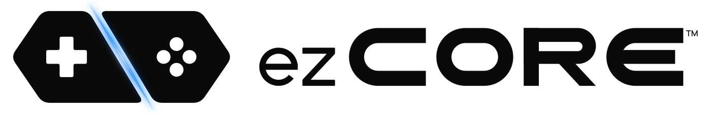
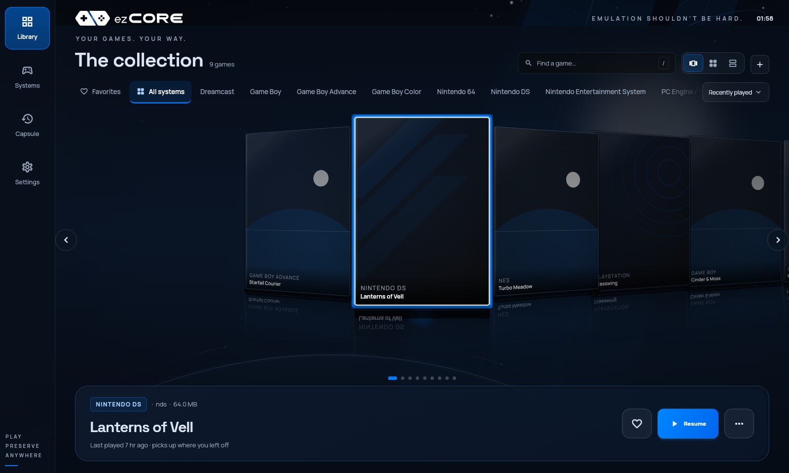
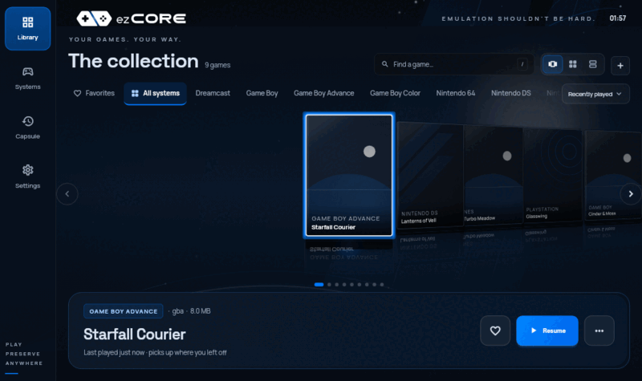
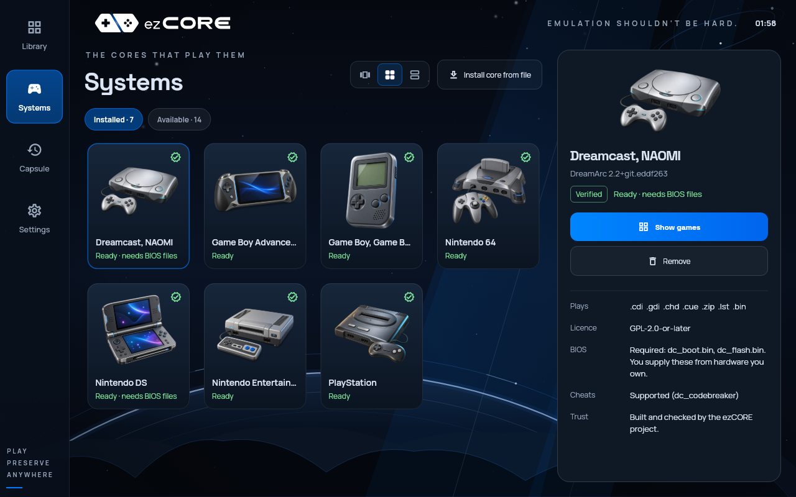
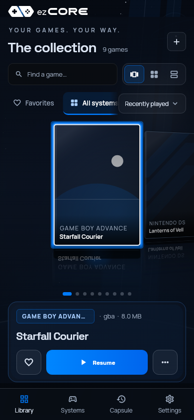

<p align="center">
  <picture>
    <source media="(prefers-color-scheme: dark)" srcset="assets/branding/lockup-light.png">
    <source media="(prefers-color-scheme: light)" srcset="assets/branding/lockup-dark.png">
    
  </picture>
</p>

<p align="center">
  <strong>Every game you own, in one place. Pick it up exactly where you left off.</strong><br>
  <em>An open-source home for emulators: one app, many systems, cores you can add and remove like apps.</em>
</p>

<p align="center">
  <a href="https://github.com/0xJ1nn/ezcore/releases">
    
  </a>
  <a href="LICENSE">
    
  </a>
  
  <a href="https://github.com/sponsors/0xJ1nn">
    
  </a>
</p>

<p align="center">
  <a href="#what-it-feels-like">Tour</a> ·
  <a href="#what-you-can-play">Systems</a> ·
  <a href="#download">Download</a> ·
  <a href="#cores-are-apps">Cores are apps</a> ·
  <a href="#build-from-source">Build</a> ·
  <a href="#contributing">Contribute</a>
</p>

<p align="center">
  
</p>

---

## What it feels like

ezCORE is built like an operating system for your games: one top bar, four
spaces — **Library**, **Systems**, **Capsule** and **Settings** — and keys
<kbd>1</kbd>–<kbd>4</kbd> to move between them.

**Your collection on a shelf.** Games stand on a glossy 3D shelf, the one in
front lit up over its own art. Swipe, scroll, use the arrow keys or a
controller's d-pad; the dock underneath tells you what it is and offers one
thing to do — **Resume** if you've played it, **Let's play** if not.

<p align="center">
  
</p>

**Resume, in one tap.** The shelf opens on the game you played last — whatever
system it is — and Resume puts you back exactly where you stopped. No menus, no
choosing an emulator, no hunting for a save.

**3D, Grid or List.** Prefer a wall of covers or a tidy list? Switch views top
right; ezCORE remembers. Grid and List keep Resume and *Continue playing* on
top. Add a file or a whole folder and ezCORE works out what each game is and
which core plays it; filter by system, favourite, sort, search with <kbd>/</kbd>.

<p align="center">
  
</p>

**Systems: cores you can see.** Every emulator core is shown by the systems it
plays, with honest status (ready, needs BIOS, update available) and whether the
project has verified it. Install, update or remove one like an app.

<p align="center">
  
</p>

**Capsule: every save, for every game.** Save states are kept per game, named
in plain words, and one tap from the rail.

**A real page for every game.** Its own art, Resume or Play, every save as a
card you can load or delete, the core it uses, cheats, and the file.

<p align="center">
  
</p>

**Controls that fit the system.** On a phone or tablet each system gets its own
on-screen layout — Nintendo letters, PlayStation symbols, Genesis A/B/C,
shoulders, Start and Select — and handhelds get a device shell. The Nintendo
DS shows its two screens as a clamshell with a hinge. Drag, resize, fade or hide
any button and save it per system; **Reset** brings the default back.

<p align="center">
  
  &nbsp;&nbsp;
  
</p>

<p align="center">
  
</p>

**Bring your controller.** It drives every screen; remap any button by pressing
it; hold **Select + Start** for the pause menu. A **P1** badge in the top bar
tells you it's connected.

**A pause menu that respects your progress.** Resume, save and load, cheats,
edit controls, fast-forward, screenshot, reset and quit. Back never drops you
out of a game by accident.

**Crash protection** *(experimental, desktop)*. Turn it on and each core runs in
its own helper process: if a core crashes or freezes, only that game ends, with
a plain message. The app, your library and your saves are untouched.

---

## What you can play

ezCORE hosts existing open-source emulator cores (the [libretro](https://www.libretro.com/)
plugin standard) rather than rewriting emulators. What is listed below is what
has been **proven**, not what is hoped: *boots and saves* means the core loaded
real test content, drew frames, and survived a save-state round trip on the
platform named. Evidence for every cell is in [`docs/MATRIX.md`](docs/MATRIX.md).

| System | Core | Today |
|---|---|---|
| Game Boy / Game Boy Color | PocketBit (SameBoy) | ✅ Boots and saves (Linux, macOS) |
| Game Boy Advance | AdvanceBit (mGBA) | ✅ Boots and saves (Linux, macOS) |
| NES / Famicom | NesByte (Mesen) | ✅ Boots and saves (Linux) |
| PlayStation | Geometry1 (SwanStation) | ✅ Boots and saves (Linux) |
| Nintendo DS | DualScreen (melonDS) | ✅ Boots and saves (Linux) |
| Nintendo 64 | RCP64 (Mupen64Plus-Next) | ✅ Boots and saves on the GPU (GLideN64) and in software (Linux) |
| Dreamcast | DreamArc (Flycast) | ✅ Boots and saves on the GPU (OpenGL, Linux) |
| PC Engine / TurboGrafx-16 · Atari 2600 · Saturn | CardCon · Joystick · TwinSH | Starts; not yet verified with content |
| DOS · SCUMM adventures | RealMode (DOSBox Pure) · PointClick (ScummVM) | Starts; content verification in progress |
| PSP · GameCube / Wii | PortComp · PowerCube | GPU context works; booting content is still being fixed |
| Super Nintendo · Genesis · Arcade | SuperFX · BlastProc · CoinBox | Work, but their licences forbid redistribution: build them yourself |
| PS2 · 3DS · Switch | — | Held: not built or shipped under project policy |

**Newer consoles** (PS3 and later, Xbox, PC games) are large standalone
emulators that don't use the plugin standard. ezCORE's plan for them is to
launch and supervise them while keeping your library, saves and controllers in
one place — see [`docs/PLATFORM.md`](docs/PLATFORM.md). They are not available
today.

ezCORE ships **no games, BIOS files or keys**. You add the ones you own.
System names identify compatibility targets only; marks belong to their owners
([`TRADEMARKS.md`](TRADEMARKS.md)).

---

## Download

| Platform | How | Verified |
|---|---|---|
| **Linux x64** | [Build from source](docs/BUILDING.md); release archive with the next release | Runs and is tested here |
| **Android arm64** | [Latest release](https://github.com/0xJ1nn/ezcore/releases/latest) `.apk` | Builds; on-device testing continues |
| **macOS arm64** | [Latest release](https://github.com/0xJ1nn/ezcore/releases/latest) `.zip` | Ran at v0.1.1; current build not yet re-verified |
| **Windows x64** | [Build from source](docs/BUILDING.md) | Not yet verified |
| **iOS** | [Build guide](docs/BUILDING.md) | Not yet verified (Apple only allows cores built into the app) |

Releases come from GitHub only; there is no app-store listing. First launch,
folders and BIOS placement: [`docs/INSTALL.md`](docs/INSTALL.md).

<details>
<summary><strong>macOS first launch</strong></summary>

Releases are ad-hoc signed and may not be notarized. If macOS blocks the app,
right-click it and choose **Open**, or:

```bash
xattr -cr /Applications/ezCore.app
```
</details>

---

## Cores are apps

ezCORE is built like an operating system for games: the app is the home, and
each emulator **core** is a replaceable part you can install and remove.

- **Official cores** are built and checked by the project and labelled
  **Verified**. Every core file is checked against its published fingerprint
  before it runs.
- **Your own cores**: anyone can package a core. Install one from a folder and
  it is labelled **Unverified** — opt-in, never auto-updated, and (with crash
  protection on) unable to take the app down with it.
- **Packages are data plus one library.** A package can bring recommended
  settings and its own on-screen layouts and shells for its systems; none of
  that data can run code or reach the network.

How to build and package a core: [`docs/CORE_AUTHORING.md`](docs/CORE_AUTHORING.md)
and the package format, [`docs/PACKAGE_FORMAT.md`](docs/PACKAGE_FORMAT.md). The
rules that may never be broken — cores never touch the UI, data never executes,
claims must match evidence — are in [`docs/PLATFORM.md`](docs/PLATFORM.md).

<details>
<summary><strong>How it fits together</strong></summary>

```
┌──────────── Flutter app (Dart) ────────────┐
│ Library · Cores · Settings · Player         │
│ controls engine · saves · controller input  │
└───────────────┬─────────────────────────────┘
                │ C ABI (in-process, or a helper process with crash protection)
┌───────────────▼─────────────────────────────┐
│ ezCORE runtime (C11): sessions, video,      │
│ audio, input, options, save states          │
└───────────────┬─────────────────────────────┘
                │ libretro
┌───────────────▼─────────────────────────────┐
│ cores: verified or your own, one per system │
└─────────────────────────────────────────────┘
```

Details: [`docs/ARCHITECTURE.md`](docs/ARCHITECTURE.md).
</details>

---

## Where it's going

Next up: PSP and GameCube on the GPU, Vulkan for the cores that prefer it,
crash protection on every desktop and Android, single-file core packages anyone
can share, and verified builds for every platform. Sticks, keyboard, mouse and
touch already reach every core. The full plan
is [`ROADMAP.md`](ROADMAP.md); what changed lately is in
[`CHANGELOG.md`](CHANGELOG.md).

---

## Build from source

```bash
git clone https://github.com/0xJ1nn/ezcore.git
cd ezcore

scripts/build_core.sh --fetch-headers
scripts/build_runtime.sh linux        # or macos
EZCORE_PLATFORM=linux scripts/build_core.sh --tier-desktop
python3 scripts/build_catalog.py

flutter pub get
flutter analyze
flutter test
ctest --test-dir runtime/build-linux --output-on-failure

flutter run -d linux                  # or macos
```

Prerequisites and every platform: [`docs/BUILDING.md`](docs/BUILDING.md).

---

## Contributing

Good first contributions:

- A bug fix with a test that fails without it.
- A verification report from a real device (Windows, macOS, Android, iOS).
- A core build, licence or compatibility improvement.
- Freely licensed test content with clear provenance.
- Design and UX work, and docs that get the next person to **Play** faster.

Start with [`CONTRIBUTING.md`](CONTRIBUTING.md) and [`project.md`](project.md):
one clear problem per pull request. The project never accepts ROMs, BIOS,
firmware, keys, circumvention tools or held-system cores.

## Support ezCORE

ezCORE is free, open source and works fully offline, with no account. If it
earns a place in your setup, you can
**[sponsor it on GitHub](https://github.com/sponsors/0xJ1nn)** — but
code, testing, bug reports, art and docs count just as much. Security:
[`SECURITY.md`](SECURITY.md). Help: [`SUPPORT.md`](SUPPORT.md).

## License and credits

- **App and runtime:** [GPL-3.0-only](LICENSE).
- **Cores:** each keeps its upstream licence; see its manifest and
  [`THIRD_PARTY_NOTICES.md`](THIRD_PARTY_NOTICES.md).
- **Fonts:** Space Grotesk and Manrope, [SIL Open Font License 1.1](assets/fonts/OFL.txt).
- **Trademarks:** [`TRADEMARKS.md`](TRADEMARKS.md).

ezCORE stands on the work of the [libretro](https://www.libretro.com/) community
and the open-source emulator ecosystem. Screenshots show invented titles with
generated cover art; the in-game frame is the project's own CC0 test ROM. The
brand files and how they are made: [`docs/BRAND.md`](docs/BRAND.md).

<p align="center">
  <sub>One home for every game you own.</sub>
</p>
