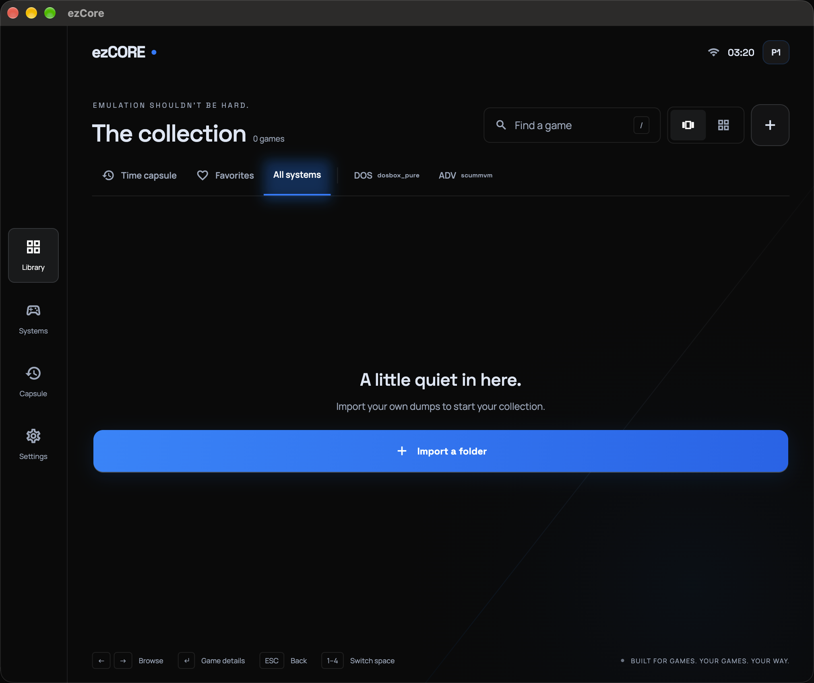

# Installing ezCORE

> Applies to the current **v0.2.x** release line — an early public build.
> Read the notice in the [README](../README.md) first: exact artifact
> availability varies by release and several cores have uneven verification.
> See [`MATRIX.md`](MATRIX.md) for current evidence.

## What's in this release

| Platform | Artifact | Status |
|---|---|---|
| Linux (x64) | `ezcore-<version>-linux-x64.tar.gz` | attached in v0.2.0; see the release notes for exact assets |
| Android (arm64) | `ezcore-<version>-android-arm64.apk` | attached in v0.2.0; app artifact only, core/device boot not verified |
| macOS (Apple Silicon) | — | not attached in v0.2.0; build from source or use a later release |
| Windows (x64) | — | not attached in v0.2.0; build from source ([BUILDING.md](BUILDING.md)) |
| iOS | — | not distributed yet (needs an Apple Developer identity) |

Download from [GitHub Releases](https://github.com/JinUltimate1995/ezcore/releases/latest). Every release page
also carries `SHA256SUMS.txt` — verify with `shasum -a 256 <file>` (macOS)
or `sha256sum <file>` (Linux). Artifact availability and verification are
release-specific; check the [v0.2.0 release notes](../.github/release-notes/v0.2.0.md)
and [`MATRIX.md`](MATRIX.md) before downloading.

## macOS (Apple Silicon)

> The current `v0.2.0` release does not attach a macOS binary. The steps below
> apply when a macOS artifact is published, or to a locally built app.

**Requires:** macOS 12 (Monterey) or later, arm64 Mac. A locally built or
older ad-hoc-signed app is not notarized.

1. Download `ezcore-<version>-macos-arm64.zip` and unzip it.
2. Move `ezCore.app` to `/Applications`.
3. First launch — macOS will block the un-notarized app. Either
   right-click → **Open** → **Open**, or clear the quarantine flag once:
   ```bash
   xattr -cr /Applications/ezCore.app
   ```
4. Open from Applications. Cores marked bundled are included; eligible large
   desktop cores may be downloaded explicitly and are hash-verified before
   staging.

## Android (arm64)

> The current `v0.2.0` APK is an app artifact only. Android runtime/core
> artifacts and on-device boot were not verified on the release host.

**Requires:** Android 7.0 (API 24) or later, arm64-v8a device.

1. Download `ezcore-<version>-android-arm64.apk` on the device (or copy it
   over).
2. Allow installing from your browser/file manager ("Install unknown apps").
3. Open the APK to install. The APK is signed with the project's release
   keystore — future updates will install over it as long as that key is
   used.

## First run

1. The app opens on **Library** (empty on first launch).

   

2. Import your own dumps: tap **Import** in the top bar (or "Import a
   folder" in the empty state). In the Import screen you can **Browse
   files** or type a folder path and **Scan** it, then **Import scanned
   content**. Imported games **stay where you keep them** — the library
   references your folder (on macOS, access is kept with a security-scoped
   bookmark), it does not copy files around.
3. Play: click a game cover → **Game hub** → **Play**. If the core needs
   BIOS/firmware you haven't placed yet, the player tells you exactly which
   files are missing and where they go.

Keyboard (desktop): `←`/`→` browse, `/` search, `↵` open details, `1–4`
switch between Library / Systems / Time Capsule / Settings.

## BIOS / firmware

**ezCORE ships no BIOS or firmware.** Some cores need files you supply
yourself. Place them in the app's **`system/`** folder:

| Platform | Folder |
|---|---|
| macOS | `~/Library/Application Support/ezcore/system/` |
| Windows | `%APPDATA%\ezcore\system\` |
| Linux | `~/.local/share/ezcore/system/` |
| Android | app-private data folder (not user-accessible in v0.2.x — see note) |

What each core looks for (the Systems screen and the player also name
missing files exactly):

| System | Core | Files | Required? |
|---|---|---|---|
| PC Engine CD | `beetle_pce` | `syscard3.pce` | CD titles only |
| Saturn | `beetle_saturn` | `sega_101.bin`, `mpr-17933.bin` | required (boot gate) |
| PlayStation | `swanstation` | `scph5500.bin` / `scph5501.bin` / `scph5502.bin` | optional — OpenBIOS fallback built in |
| Dreamcast | `flycast` | `dc_boot.bin`, `dc_flash.bin` | required (boot gate) |
| DS | `melonds` | `bios7.bin`, `bios9.bin`, `firmware.bin` | required (boot gate) |
| GameCube/Wii | `dolphin` | `IPL.bin` | optional (HLE default) |
| NES (FDS) | `mesen` | `disksys.rom` | FDS titles only, optional |
| Genesis/SMS | `genesis_plus_gx` | `bios_MD.bin`, `bios_SMS.bin` | optional |
| Arcade/Neo Geo | `fbneo` | `neogeo.zip` (+ per-board BIOS) | Neo Geo sets only — core held from v0.2.x |

> **Android note (v0.2.x):** the `system/` folder lives inside the app's
> private storage, which isn't reachable from normal file managers yet.
> Desktop is the supported place for BIOS files today; mobile placement is
> planned. Cores that don't need firmware (GB/GBC, GBA, NES, SNES, Genesis,
> Atari, DOS, TG-16 cards, PS1 with the built-in OpenBIOS) do not require a
> firmware file.

## Notice

**ezCORE ships zero copyrighted content.** No ROMs, BIOS, firmware, keys,
game art, or cheat databases are included or linked. You must provide your
own game dumps and firmware. See
[TRADEMARKS.md](../TRADEMARKS.md), [DMCA.md](../DMCA.md),
[CONTRIBUTING.md](../CONTRIBUTING.md).

## Troubleshooting

### macOS: "App is damaged / can't be opened"
```bash
xattr -cr /Applications/ezCore.app
# If that doesn't help:
codesign --force --deep --sign - /Applications/ezCore.app
```

### macOS: a folder import isn't visible after restart
Grant access again via the picker — the sandbox keeps access through
security-scoped bookmarks, and a moved/renamed folder breaks the bookmark.

### Android: "App not installed"
- Confirm the device is arm64 (most phones since ~2018).
- Uninstall any previous debug build first: Settings → Apps → ezCORE →
  Uninstall (debug and release signatures differ, so they can't upgrade
  each other).

### No games found on import
- Supported extensions include `.gb .gbc .gba .nes .fds .sfc .smc .md .gen
  .sms .gg .a26 .pce .n64 .nds .iso .cue .chd .pbp .zip` and more — the
  Systems screen lists each core's full set.
- Subfolders are scanned recursively; duplicates (same SHA-256) are skipped.
- Files for held systems (3DS/Switch/PS2) are rejected by policy.

### A game boots to a black screen
- Check [`MATRIX.md`](MATRIX.md): some cores are load-verified but not yet
  render-verified on your platform.
- If the core needs BIOS, the player's message names the exact files.

## Updating

Download the new release and replace the app. Your games, saves, vault
snapshots and settings live in the app data directory and are **not**
affected by updates.

## Uninstalling

| Platform | Method |
|---|---|
| macOS | Delete `/Applications/ezCore.app` (optionally `~/Library/Application Support/ezcore/`) |
| Windows | Delete the extracted folder (optionally `%APPDATA%\ezcore\`) |
| Linux | Delete the extracted folder (optionally `~/.local/share/ezcore/`) |
| Android | Settings → Apps → ezCORE → Uninstall |

## Support

- [GitHub Discussions](https://github.com/JinUltimate1995/ezcore/discussions) — questions, help, ideas
- [GitHub Issues](https://github.com/JinUltimate1995/ezcore/issues) — bugs and feature requests (use templates)
- [SUPPORT.md](../SUPPORT.md) — FAQ
